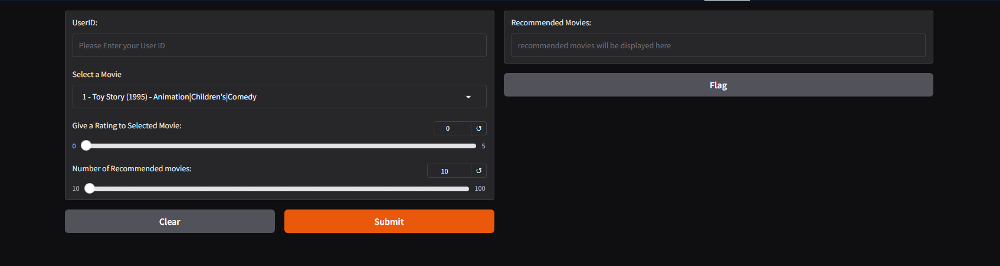
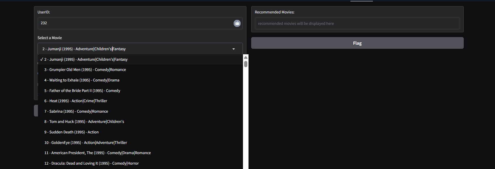
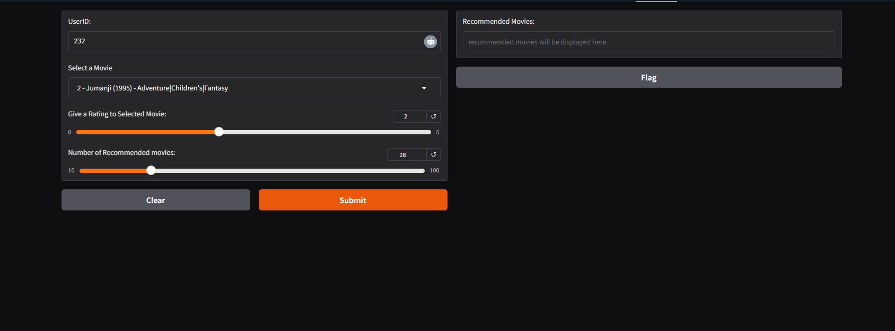
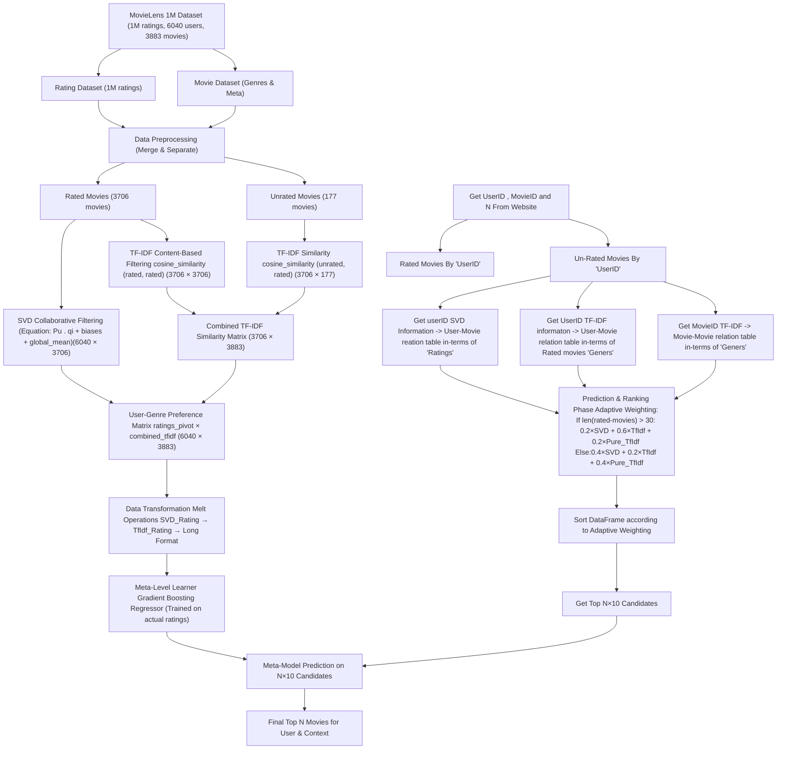

# <div align="center">🎬 Meta-Level Hybrid Movie Recommender System</div>

<div align="center">
  
  &nbsp;&nbsp;&nbsp;&nbsp;&nbsp;&nbsp;
  
  <p>
    <strong><u>Project 2:</u>&nbsp;&nbsp;Advanced Meta-Level AI-Powered Movie Recommendation Engine</strong>
  </p>
  <p>
    <em>Combining Collaborative Filtering, Content-Based Analysis & Machine Learning for Superior Recommendations</em>
  </p>
  
  <p>
    <a href="#-live-demo">🚀 Live Demo</a> •
    <a href="#-quick-installation">⚡ Quick Start</a> •
    <a href="#-model-architecture">🧠 Model Details</a> •
    <a href="#-performance-metrics">📊 Performance</a>
  </p>
  
  
  <p>
    
    
    
    
    
    
    
    
    
    
    
  </p>
</div>

---

## 🎯 About

This Meta-Level Hybrid Movie Recommender System represents is a very creative approach in development of movie recommendations, combining multiple machine learning techniques to deliver personalized and accurate suggestions. The system integrates collaborative filtering using SVD, content-based filtering using TF-IDF, and advanced ensemble methods to overcome the limitations of traditional recommendation systems.

**🔬 What makes it unique:**
- **Meta-Level Hybridization** - Combines predictions from multiple algorithms using Gradient Boosting
- **Cold Start Solution** - Handles new users and movies effectively
- **Multi-Modal Analysis** - Analyzes user preferences, movie content, and interaction patterns
- **Real-Time Predictions** - Fast inference with optimized model pipeline
- **Interactive Interface** - User-friendly Gradio web application

## ✨ Key Features

- 🤖 **Advanced ML Pipeline** - SVD + TF-IDF + Gradient Boosting Regressor
- 🎯 **Personalized Recommendations** - Tailored suggestions based on user behavior
- 📊 **Content Analysis** - Deep text analysis of movie descriptions/genres
- 🚀 **Fast Inference** - Optimized for real-time recommendations
- 🌐 **Interactive Web UI** - Built with Gradio for seamless user experience
- 📈 **Performance Metrics** - Comprehensive evaluation with RMSE, MAE, and Precision@K
- 📱 **Responsive Design** - Works on desktop and mobile devices

## 🌟 Live Demo
**[🚀 Try the Live Demo](https://huggingface.co/spaces/niazmahmud/hybridModel)**

### 📸 Application Screenshots

<div align="center">
  <!-- ADD YOUR SCREENSHOTS HERE -->
  
  <p><em>Main Recommendation Interface</em></p>
  
  
  
  <p><em>Enter User ID and Current Movie and also can give some rating on movie</em></p>
</div>

## 🧠 Model Architecture

### 🔄 Hybrid Approach Overview


Our meta-level hybrid system combines three powerful techniques:

# Meta-Level Hybrid Movie Recommendation System Architecture



## System Components:

### 1. **Data Layer**
- **Input**: MovieLens 1M dataset with 1M ratings from 6040 users on 3883 movies
- **Preprocessing**: Merge rating and movie dataframes, separate into rated (3706) and unrated (177) movies

### 2. **Feature Engineering**
- **SVD Collaborative Filtering**: 
  - Combines user factors (Pu), item factors (qi), user bias, item bias, and global mean
  - Output matrix: (6040 users × 3706 rated movies)

- **TF-IDF Content-Based Filtering**:
  - Rated movies similarity: (3706 × 3706)
  - Unrated movies similarity: (3706 × 177)  
  - Combined matrix: (3706 × 3883)

- **User-Genre Preference Matrix**:
  - Matrix multiplication: ratings_pivot × combined_tfidf
  - Output: (6040 users × 3883 all movies)

### 3. **Meta-Learning Architecture**
- **Data Transformation**: Convert matrices to long format using melt operations
- **Meta-Model**: Gradient Boosting Regressor trained on actual ratings
- **Features**: SVD_Rating, TfIdf_Rating, Pure_TfIdf_Rating

### 4. **Adaptive Recommendation Strategy**
- **Dynamic Weighting**: Adjusts feature importance based on user's rating history
- **Cold Start Handling**: Higher weight on content features for users with few ratings
- **Final Ranking**: Meta-model predicts ratings for top N×10 candidates, returns top N

### 5. **Key Advantages**
- ✅ **Hybrid Approach**: Combines collaborative and content-based filtering
- ✅ **Meta-Learning**: Learns optimal feature combinations automatically  
- ✅ **Adaptive**: Adjusts strategy based on user rating patterns
- ✅ **Cold Start**: Handles new users through content-based features
- ✅ **Scalable**: Efficient matrix operations for large datasets

## 🔧 Technical Components

#### 1. **Collaborative Filtering (SVD)**
- **Algorithm:** Singular Value Decomposition from Surprise library
- **Purpose:** Captures user-item interaction patterns
- **Strengths:** Effective for users with rating history
- **Parameters:** 
  - Factors: `100`
  - Regularization: ` 0.05`
  - Learning Rate: `0.01`

#### 2. **Content-Based Filtering (TF-IDF)**
- **Algorithm:** Term Frequency-Inverse Document Frequency
- **Features:** Movie genres, descriptions, cast, director
- **Vectorization:** Scikit-learn TfidfVectorizer
- **Similarity:** Cosine similarity matrix

#### 3. **Meta-Level Learning**
- **Algorithm:** Gradient Boosting Regressor
- **Purpose:** Combines predictions from base models
- **Features:** SVD predictions, TF-IDF similarities, metadata
- **Hyperparameters:**
  - n_estimators: `700`
  - max_depth: `7`
  - learning_rate: `0.01`

## 🛠️ Technology Stack

<div align="center">

**Machine Learning & Data Science**


**UI & Visualization**


**Development & Deployment**


</div>

## 📊 Dataset Information

### 📈 Dataset Overview
<!-- ADD YOUR DATASET DETAILS HERE -->
- **Dataset Source:** https://grouplens.org/datasets/movielens/1m/
- **Total Movies:**  3883 movies
- **Total Users:** 6040 
- **Total Ratings:** 3706 movies
- **Rating Scale:** 0 to 5
- **Sparsity:** 95.5%

### 📋 Data Features
- **User Features:** UserID, Gender, Age, Occupation, Zip-code
- **Movie Features:** MovieID, Title, Genres
- **Ratings Features:** UserID, MovieID, Rating, Timestamp

## 🚀 Installation & Setup

### Prerequisites

```bash
Python >= 3.12.8
gradio>=5.14.0
scikit-surprise>=1.1.4
scikit-learn>=1.5.2
pandas>=2.2.3
numpy>=1.26.4
joblib>=1.4.2
matplotlib>=3.10.0
Git
```

### ⚡ Quick Installation

1. **Clone the Repository**
   ```bash
   https://github.com/NiazMahmud2001/MetaLevel_hybridRecommender.git
   cd MetaLevel_hybridRecommender
   ```

2. **Create Virtual Environment**
   ```bash
   python -m venv movie_recommender_env
   
   # Windows
   movie_recommender_env\Scripts\activate
   
   # macOS/Linux
   source movie_recommender_env/bin/activate
   ```

3. **Install Dependencies**
   ```bash
   pip3 install gradio>=5.14.0 scikit-surprise>=1.1.4 pandas>=2.2.3 numpy>=1.26.4 joblib>=1.4.2
   ```

4. **Run the Application**
   ```bash
   python app.py
   ```

5. **🎉 Open Your Browser**
   ```
   http://localhost:7860
   ```

### 📦 Dependencies

<details>
<summary><strong>📋 Complete Requirements List</strong></summary>

```txt
# Core ML Libraries
scikit-surprise>=1.1.4
scikit-learn>=1.5.2

# UI Framework
gradio>=5.14.0

# Data Processing
matplotlib>=3.10.0
numpy>=1.26.4
pandas>=2.2.3

# Utilities
joblib>=1.4.2
requests>=2.32.3
```

</details>


## 📝 Project  app.py class Structure

```
├── class DataFramePreprocessor                         
│   ├── 📄 __init__()              
│   ├── 📄 get_AllDF()   
│   ├── 📄 get_number_of_rated_movies()
│   ├── 📄 get_Rated_NonRated_Movies()
│   └── 📄 addNewRating(uid, movID, mov_rating)
│
│
├── class LoadModels 
│   ├── 📄 __init__() 
│   ├── 📄 getSVDModel()
│   └── 📄 getGradientModel()
│
│
├── class SVDModel
│   ├── 📄 __init__(svdModel, svd_reader_trainset, ratingMovie_MergedDF, non_rated_movies)
│   ├── 📄 __private_get_Bias_feature_matrix()
│   ├── 📄__private_calculate_Bias_feature_matrix()
│   └── 📄 final_SVD_Vector_Table_Calculator()
│    
│    
├── class TFIDFModel
│   ├── 📄 __init__(moviesDF, ratingsDF, rated_movies, non_rated_movies)
│   ├── 📄 __private_rated_Movies_TfIdf_Vectorizer()
│   ├── 📄 __private_nonRated_Movies_TfIdf_Vectorizer()
│   ├── 📄 __private_combined_ratedNonRatedTFIDF_Vectorizer()
│   ├── 📄 get_combined_tfidf_df()
│   └── 📄 final_combnedTFIDF_Vectorizer()
│
│
├── class MetaModelPrediction
│   ├── 📄 __init__(gradientModel, SVDTable, Tf_IdfTable, pure_tf_idf_table, ratingsDF, movieDF, numbOfRatedMovies)
│   ├── 📄 __private_getTopN_Movie(UID, movieid, ret_n_movie)
│   └── 📄 metaPredicton(UID, movieid, ret_n_movie)
│
│
├── class GradioUi
│   ├── 📄 __init__()
│   ├── 📄 readMovieDF()
│   ├── 📄 processorFunc(uid, movieInfo, rating, num_rec_movies)
    └── 📄launchUI()                   
```


### 🎯 Basic Usage

```python
# lanunch the gradio app on the defined port and server
class GradioUi(): 
    .
    . 
    . 
    .
    . 
    
    def launchUI(self):
        demoUI = gd.Interface(
            fn=self.processorFunc,
            inputs=[
                gd.Textbox(label="UserID:", placeholder="Please Enter your User ID"),
                gd.Dropdown(label="Select a Movie", choices= self.readMovieDF()),
                gd.Slider(label="Give a Rating to Selected Movie:", minimum=0, maximum=5, step=1, value=0),
                gd.Slider(label="Number of Recommended movies: ", minimum=10, maximum=100, step=1, value=10)
            ],
            outputs=[gd.Textbox(label="Recommended Movies:", placeholder="recommended movies will be displayed here")]

        )
        # demoUI.launch()
        demoUI.launch(share=True, server_name="0.0.0.0", server_port=7860)


if __name__ == "__main__": 
    GradioUi().launchUI()
```


### 🔧 Advanced Configuration for SVD

```python
# SVD model training parameters
hyperParamGrids = {
    "n_factors": [50, 100, 150, 200],
    "lr_all" : [0.002, 0.003, 0.005, 0.007, 0.009, 0.01, 0.02, 0.05],
    "reg_all": [0.002, 0.003, 0.005, 0.007, 0.009, 0.01, 0.02, 0.05]
}
gridSearch = GridSearchCV(
    algo_class = SVD, 
    param_grid = hyperParamGrids, 
    measures=["rmse", "mae"], 
    cv= 3, 
    refit=False , 
    joblib_verbose = 2,
    n_jobs=-1, 
)
gridSearch.fit(svd_reader_train)


model = SVD(
    n_factors= gridSearch.best_params['rmse']['n_factors'], 
    n_epochs= 200,
    biased= True,
    lr_all = gridSearch.best_params['rmse']['lr_all'],
    reg_all= gridSearch.best_params['rmse']['reg_all'],
    verbose = True
)
model.fit(svd_reader_trainset)
```


### 🔧 Advanced Configuration for TF-IDF

```python
# TF-IDF model training parameters
prep_all_movies = ColumnTransformer(
    transformers=[
        ('genresTFIDF',  TfidfVectorizer(
            lowercase=True,
            stop_words='english',
            ngram_range=(1,18),
            max_df=0.9,
            min_df=1,
            max_features=500,
            analyzer="word", 
            token_pattern=r'[^|]+'
        ), 'Genres')
    ],
    remainder='drop'
)
prep_all_movies.fit(moviesDF)
```


## 📈 Performance Metrics

### 🎯 Model Performance
<!-- ADD YOUR PERFORMANCE METRICS HERE -->

| Metric | SVD Only | Meta-Level Hybrid Model |
|--------|----------|-------------------------|
| **RMSE** | 0.165  |         0.0586          |
| **MAE** | 0.1319  |         0.0782          |


# Project Structure

```
movie-recommender-system/
├── 📁 ml-1m/                        # dataset folder            
│   ├── 📄 movies.dat                
│   ├── 📄 ratings.dat               
│   ├── 📄 users.dat               
│               
├── 📁 trainedModel/                 # Trained models
│   ├── 📄 gradient_model.pkl        # hybrid model
│   ├── 📄 svd_model.pkl 
│   ├── 📄 svd_reader_trainset.pkl 
│
│── app.py
│── Dockerfile
│── main10.ipynb                      # project testing and developing notebook

```


## 🚀 Deployment

### 🐳 Docker Deployment

```bash
# Build the Docker image
docker build -t movie-recommender .

# Run the container
docker run -p 7860:7860 movie-recommender
```


## 🤝 Contributing

We welcome contributions from the community! Here's how you can help:

### 🎯 Areas for Contribution
- 🤖 **Algorithm Improvements** - New recommendation techniques
- 🎨 **UI/UX Enhancement** - Better user interface design
- 📊 **Evaluation Metrics** - Additional performance measures
- 🔧 **Code Optimization** - Performance improvements
- 📚 **Documentation** - Better guides and tutorials
- 🐛 **Bug Fixes** - Issue resolution


## 📚 Additional Resources

### 📖 Learning Materials
- [Surprise Library Documentation](https://surprise.readthedocs.io/en/stable/matrix_factorization.html)
- [Methmetical SVD](https://www.geeksforgeeks.org/singular-value-decomposition-svd/)
- [Scikit-learn GBR Guide](https://scikit-learn.org/stable/modules/generated/sklearn.ensemble.GradientBoostingRegressor.html)
- [Gradio Documentation](https://www.gradio.app/docs)


## 📞 Contact & Support

**👨‍💻 Developer:** Niaz Mahmud
- **GitHub:** [@NiazMahmud](https://github.com/NiazMahmud2001?tab=repositories)
- **LinkedIn:** [LinkedIn Profile](www.linkedin.com/in/niaz-mahmud-5b158b245)
- **Email:** [U21102204@sharjah.ac.ae](mailto:U21102204@sharjah.ac.ae)

---

<div align="center">
  <p><strong>Made with ❤️ and lots of ☕</strong></p>
  <p>⭐ <strong>Star this repository if you found it helpful!</strong> ⭐</p>
</div>


